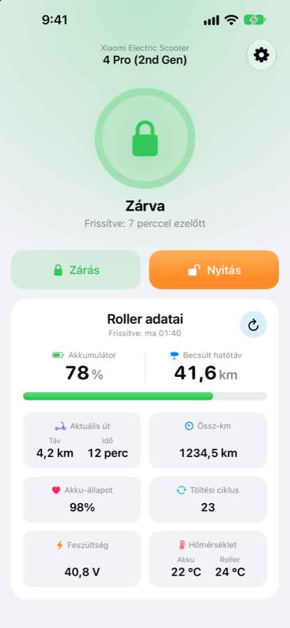
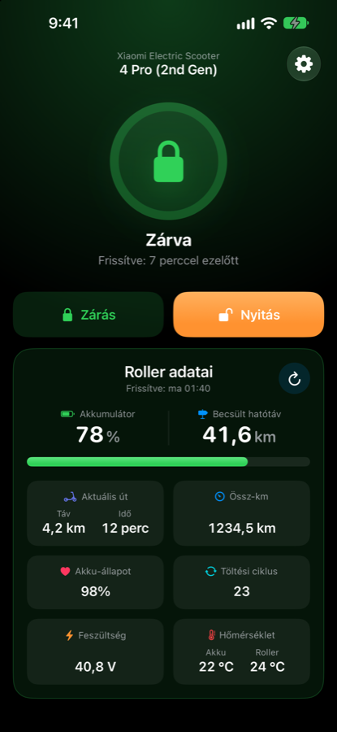
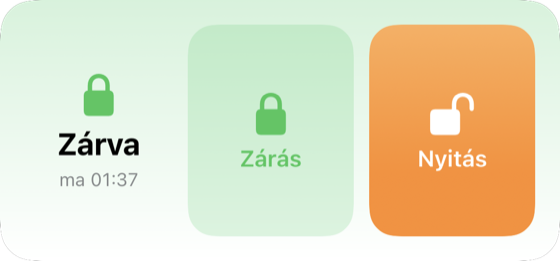
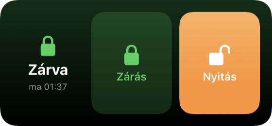

# iPhone app (ScooterLink)

A native SwiftUI + CoreBluetooth app that locks, unlocks and reads the scooter using the
**phone's own Bluetooth** — no Mac and no cloud at runtime. It comes with a home-screen
widget and Control Center controls. The UI is in Hungarian.

<p>
  
  
</p>
<p>
  
  
</p>

## Requirements

- A Mac with **Xcode** (tested with Xcode 27; the app targets iOS 18+) and
  [XcodeGen](https://github.com/yonaskolb/XcodeGen): `brew install xcodegen`
- An Apple ID signed in to Xcode (Xcode → Settings → Accounts). A free account works;
  apps signed with it expire after **7 days** and have to be reinstalled.
- An iPhone with iOS 18 or later, connected by cable or on the same network.
- The encrypted BLE key and the scooter PIN — see [getting-the-key.md](getting-the-key.md).

If Xcode was just installed:

```bash
sudo xcode-select -s /Applications/Xcode.app/Contents/Developer
sudo xcodebuild -license accept
xcodebuild -runFirstLaunch
```

## Configure signing

The Xcode project is generated from `ios/ScooterLink/project.yml`. Your team and a unique
bundle ID prefix go into `ios/ScooterLink/signing.env` (git-ignored):

```bash
cd ios/ScooterLink
cp signing.env.example signing.env
# edit signing.env:
#   DEVELOPMENT_TEAM  = your Team ID (Xcode → Settings → Accounts → your team,
#                       or developer.apple.com → Membership)
#   BUNDLE_ID_PREFIX  = something unique, e.g. com.yourname.scooterlink
./generate.sh
```

The prefix yields the app ID `<prefix>.app`, the widget `<prefix>.app.widgets` and the App
Group `group.<prefix>.app`. Xcode registers them automatically on the first build.

## Build and install

Find your phone's identifier:

```bash
xcrun devicectl list devices
```

Build and install from the command line (the build output stays in
`ios/ScooterLink/build/`):

```bash
cd ios/ScooterLink
xcodebuild -project ScooterLink.xcodeproj -scheme ScooterLink \
  -destination 'id=<DEVICE_ID>' -configuration Debug \
  -allowProvisioningUpdates -derivedDataPath build build
xcrun devicectl device install app --device <DEVICE_ID> \
  build/Build/Products/Debug-iphoneos/ScooterLink.app
```

Alternatively open `ScooterLink.xcodeproj` in Xcode, pick your iPhone and press Run.

On the first launch iOS asks you to trust the developer: **Settings → General → VPN &
Device Management** → your Apple ID → Trust.

## Using the app

1. **Settings** (gear icon): enter the **scooter PIN** (*Roller PIN*) and the **encrypted
   BLE key** (*Felhőkulcs*). Both are hidden fields (eye icon to reveal) and are stored in
   the Keychain, on this device only.
2. **First action = setup.** The app scans for t2336 scooters. If one rejects the key (someone
   else's identical scooter), it is skipped and the next one is tried (up to 5). After the
   first **successful** login the scooter is remembered and shown in Settings under
   *Rögzített roller* (name, date, identifier). From then on the app connects only to that
   scooter — directly, without scanning. *Roller elfelejtése* (forget) makes the next action
   from the app search again, e.g. for another scooter.
3. **Cruise control on unlock** (Settings → *Menet* → *Tempomat nyitáskor*, off by default):
   when on, every unlock also turns cruise control back on. The controller forgets this
   setting on every power-off (it is region/hardware enforced), so it only lasts for the
   session — enabling it on each unlock keeps it on for the ride. If the write fails the
   unlock still counts. Cruise control is not legal on public roads in every country.
4. **Zárás / Nyitás** (lock / unlock) sends only the command — it does not read data.
5. The round **↻** button on the *Roller adatai* card reads the scooter's data: battery
   and estimated range, current trip (distance + time) and odometer, battery health and
   charge cycles, voltage, battery and controller temperature. The last values are kept
   with a timestamp.

The main screen never scrolls; the lock circle adapts to the available space.

## Widget and controls

- **Home-screen widget** (medium): long-press the home screen → *Edit* → *Add Widget* →
  *ScooterLink*. It shows the lock state with the time of the last action and two large
  buttons. It does not read battery or range. If an action fails it shows
  *Zárás / Nyitás sikertelen*.
- **Controls** *Roller zárása* / *Roller nyitása* (lock / unlock): add them to Control
  Center, to the Lock Screen's bottom buttons, or to the Action button (Settings → Action
  Button → Controls).
- Both actions also appear in the **Shortcuts** app.

How it works: a widget button or control runs an App Intent that the system executes **in
the app's process** (`LiveActivityIntent`; the app is launched in the background if
needed) — a widget extension cannot drive Bluetooth itself. The app therefore has the
`bluetooth-central` background mode. In the background iOS does not scan, so the widget and
the controls use the remembered scooter; do the first-time setup from the app.

**Security:** lock and unlock require an unlocked phone — from the Lock Screen, Face ID or
the passcode is requested first.

## Reliability

- **Retries:** on a weak signal the login or the data channel can stall. The app then
  disconnects and retries with a fresh connection (up to 3 attempts, shown as e.g.
  *Bejelentkezés… (2/3)*). It does not retry when the scooter rejects the login (wrong PIN
  or outdated key), when the scooter is not found, when Bluetooth is off, or when the
  PIN/key is missing. Lock and unlock set a target state, so repeating them is safe.
- **Speed:** a lock or unlock takes about 4 s (median) including connect and login; see
  [protocol.md › Timing](protocol.md#6-timing).
- One operation runs at a time; an action from a widget waits for one started in the app.

## Testing and diagnostics

**Core tests without Xcode** (crypto and protocol against reference vectors, retry rules,
frame queue):

```bash
bash ios/verify/run.sh
```

**On the phone, with the real scooter** (Debug build, started from the Mac). Every test
re-applies the *current* lock state, so nothing changes physically:

```bash
xcrun devicectl device process launch --console --terminate-existing \
  --device <DEVICE_ID> <BUNDLE_ID_PREFIX>.app -- -selftest -intentTest
```

| Launch argument | What it does |
| --- | --- |
| `-selftest` | reads the data, then locks/unlocks with one simulated login failure (exercises the retry) |
| `-intentTest` | runs the same path as the widget and the controls, and checks the shared widget state |
| `-forgetScooter`, `-rejectOnce` | forget the remembered scooter / make the next login look rejected — together with `-intentTest` they exercise first-time setup and skipping a scooter that rejects the key |
| `-bench N -configs "400/600/d,400/800/s" [-pause 0] [-withRetry]` | handshake benchmark: configurations (post-discovery / post-A4 wait in ms; `d` = direct connect, `s` = scan, `d0.05` = direct with 0.05 s fallback) run round-robin; prints success rate, retries and min/median/max per configuration |
| `-timing 400/600/d` | uses the given timing for the whole run |

**Log file:** every action (source `VM` = app, `WIDGET` = widget/control; BLE steps,
result and duration) is appended to `Documents/scooterlink.log` in the app container. It
contains neither the PIN nor the key.

```bash
xcrun devicectl device copy from --device <DEVICE_ID> \
  --domain-type appDataContainer --domain-identifier <BUNDLE_ID_PREFIX>.app \
  --source Documents/scooterlink.log --destination ./scooterlink.log
```

**Widget state:** after every action the app writes the lock state to
`Library/Application Support/widgetState.json` in the App Group container and reloads the
widget; the widget writes one line per reload (the state it read) to `widget.log` next to it:

```bash
xcrun devicectl device copy from --device <DEVICE_ID> \
  --domain-type appGroupDataContainer --domain-identifier group.<BUNDLE_ID_PREFIX>.app \
  --source "Library/Application Support/widget.log" --destination ./widget.log
```

**UI in the Simulator** (the Simulator has no Bluetooth): `-demo` shows sample data;
`-demoBusy`, `-demoError` and `-demoEmpty` show other states; `-demo -renderWidgets`
writes widget images (light/dark, four states) to the app's `Documents` folder.

## Project structure (`ios/ScooterLink/`)

| Path | Contents |
| --- | --- |
| `ScooterLink/ScooterCrypto.swift` | ECDH-P256, HKDF, AES-CCM (own RFC 3610 implementation), MD5, AES-CBC, CRC32 |
| `ScooterLink/ScooterProtocol.swift` | SPEC frames (GET op=2 / SET op=0), encryption, property map, `Telemetry` |
| `ScooterLink/ScooterBLE.swift` | CoreBluetooth: direct connect / scan by product ID, A4 handshake, login, SPEC transport |
| `ScooterLink/FrameQueue.swift` | async queue for BLE notifications (timeouts, wake-up on disconnect) |
| `ScooterLink/Retry.swift` | error classification (transient / final) and retry |
| `ScooterLink/ScooterService.swift` | one operation: connect → login → command → disconnect, with retries; shared by the app and the widget |
| `ScooterLink/ScooterViewModel.swift`, `ContentView.swift`, `SettingsView.swift` | the UI |
| `ScooterLink/Keychain.swift`, `AppLog.swift` | PIN/key storage, persistent log |
| `Shared/` | compiled into both the app and the widget: App Intents, shared widget state (JSON file in the App Group container), widget view, formatting |
| `ScooterWidgets/` | the widget extension: home-screen widget and the two controls |
| `tools/make_icon.swift` | renders the app icon (light, dark, tinted): `swift tools/make_icon.swift ScooterLink/Assets.xcassets/AppIcon.appiconset` |
| `project.yml`, `generate.sh`, `signing.env.example` | project generation and signing configuration |

## Troubleshooting

- **The widget does not change after lock/unlock.** First check `widget.log` (see above):
  every reload writes one line with the state the widget read. If the log shows the new
  state but the home screen keeps an old picture, iOS's widget cache is stuck — this can
  happen after reinstalling development builds many times. Restart the phone.
- **"login rejected" although the PIN is right:** the cloud rotated the key — fetch it
  again ([getting-the-key.md](getting-the-key.md)).
- **The scooter is not found:** it must be on, and no other phone (Mi Home) may be
  connected to it.

## Limitations

- Supports the **t2336** only (MiBeacon product ID `0x403D`).
- The phone's Bluetooth must be on, and no other phone may be connected to the scooter.
- Widget and control actions reach only the remembered scooter (set up from the app).
- One scooter per app installation (one PIN, key and remembered scooter).
